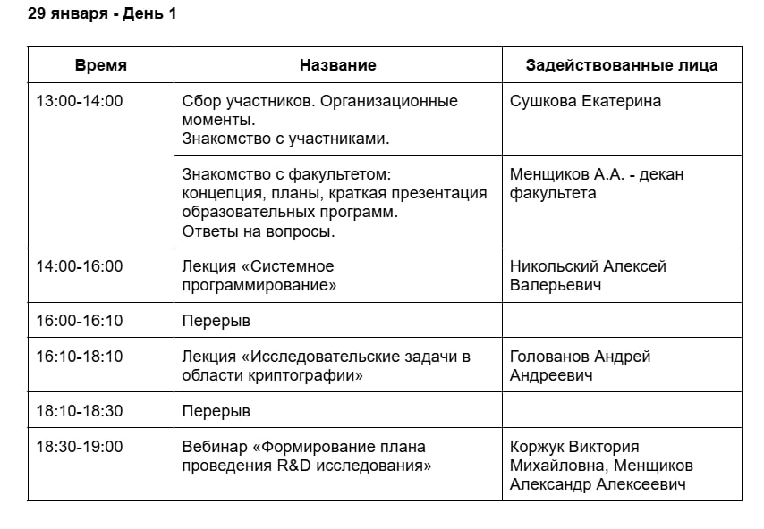

Университет ИТМО организовал весьма интересный ивент, называется МегаШкола, во время этой олимпиады выступало большое количество спикеров, по моему направлению увидеть спикеров и темы их докладов можно на фотографиях ниже:

Так же в программу ивента входит и состязательный момент, в рамках программы предусмотрена разработка своего научного исследования на произвольную тему (из сферы ИБ), авторы лучших работ получают возможность попасть в магистратуру ИТМО без вступительных экзаменов.